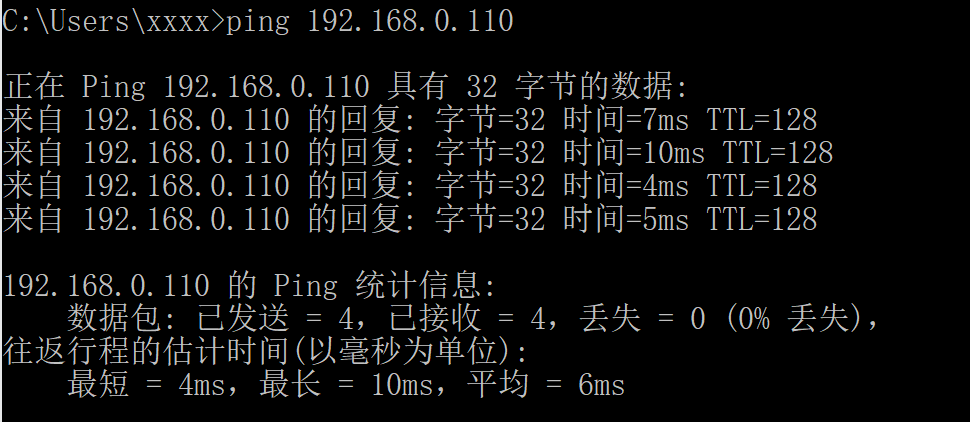
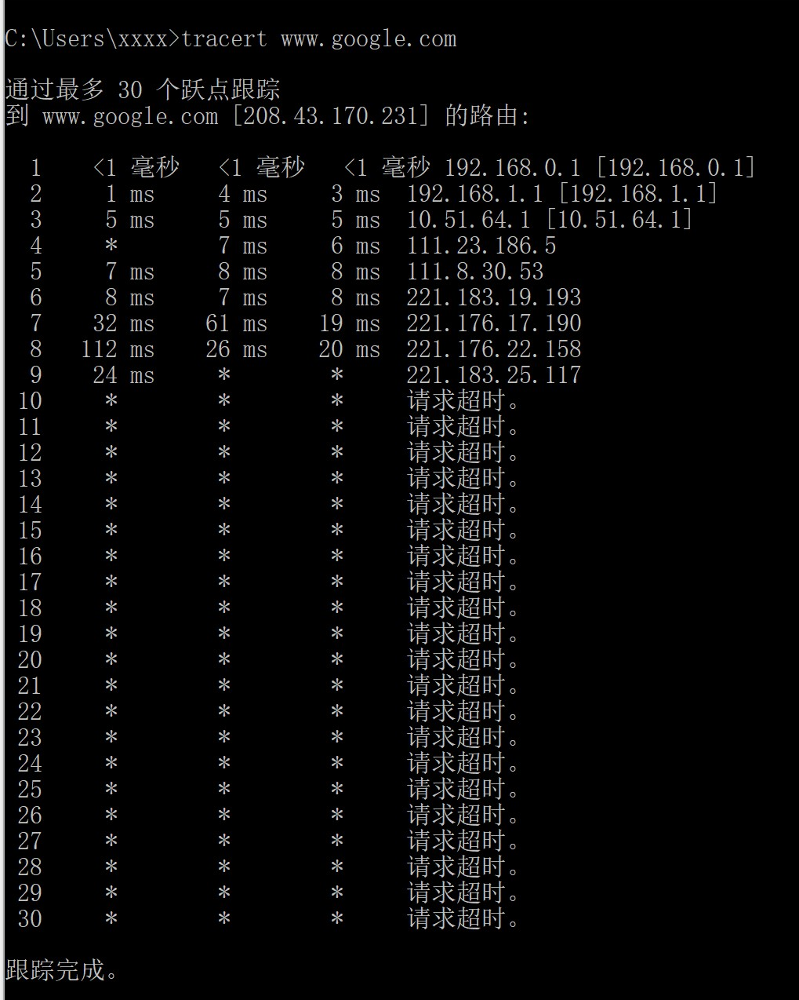

# 网络及分布式第一次作业

2017302580201-贺谷穗子

### 一、ping 另外一台计算机

Telnet协议是TCP/IP协议族中的一员，是Internet远程登录服务的标准协议和主要方式。在终端使用者的电脑上使用telnet程序，用它连接到服务器。

下面是我ping局域网下另一台电脑的截图：

### 二、tracert一个服务器

traceroute是一个正确理解IP网络并了解网络路由的重要工具，是网络工程人员和系统管理员的常用程序。当数据报从一台计算机经过多个网关送到目的地时，traceroute命令可以用来跟踪数据报使用的路由（路径）。该实用程序跟踪的路径是源计算机到目的地的一条路径，不能保证或认为数据总遵循这个路径。

下面是我tracert谷歌的截图：

