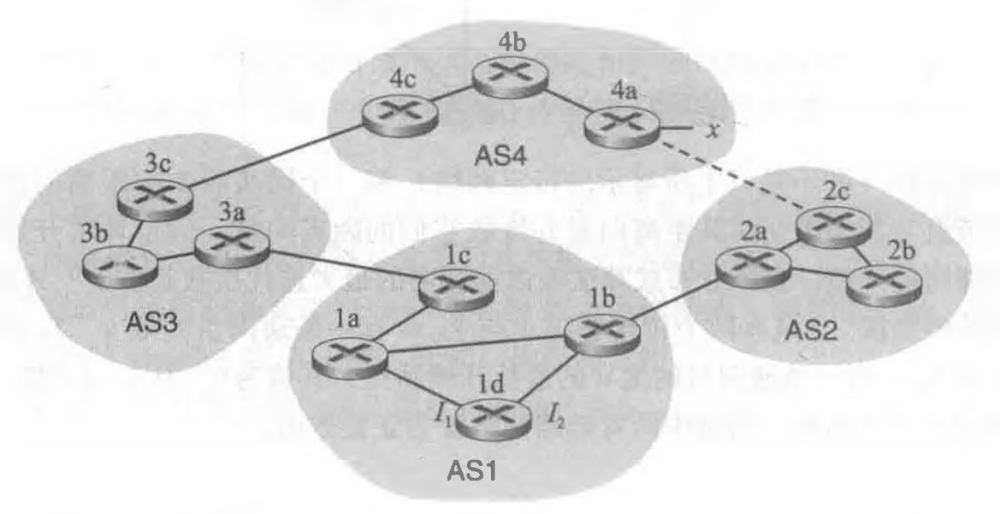

# 网络及分布式第十次作业

2017302580201-贺谷穗子

### 一、课本第五章习题选做三道

> P10.讨论图5-6中的距离向量算法，距离向量D(x)中的每个值不是递增的并且最终将在有限步中稳定 下来。

x在每个步骤中，节点距离矢量的每次更新都基于Bellman-Ford方程，即仅减小其距离矢量中的那些值。 价值没有增加。  因此，D（x）不增加。 由于这些成本是有限的，因此最终距离矢量将以有限的步长稳定下来。

> p14.考虑下图所示的网络。假定AS3和AS2正在运行OSPF作为其AS内部路由选择协议。假定AS1和 AS4正在运行RIP作为其AS内部路由选择协议。假定AS间路由选择协议使用的是eBGP和iBGP。 假定最初在AS2和AS4之间不存在物理链路。 
>
> a.路由器3c从下列哪个路由选择协议学习到了前缀心OSPF、RIP, eBGP或iBGP? 
>
> b.路由器3a从哪个路由选择协议学习到了前缀x?
>
> c.路由器1c从哪个路由选择协议学习到了前缀x?
>
> d.路由器1d从哪个路由选择协议学习到了前缀x?
>
> 

a. eBGP

b. iBGP

c. eBGP

d. iBGP

> P15.参考前面习题P14, —旦路由器1d知道了x的情况，它将一个表项(x，l)放入它的转发表中。 
>
> a.对这个表项而言，l将等于l1还是l1？用一句话解释其原因。 
>
> b.现在假定在AS2和AS4之间有一条物理链路，显示为图中的虚线。假定路由器Id知道经AS2以 及经AS3能够访问到x。l将设置为l1还是l2？用一句话解释其原因。
>
> c.现在假定有另一个AS,它称为AS5,其位于路径AS2和AS4之间(没有显示在图中)。假定路由器Id知道经AS2 AS5 AS4以及经过AS3 AS4能够访问到x。l将设置为l1还是l2？用一句话解释 其原因

a.I1，因为此接口开始了从1d到网关路由器1c的成本最低的路径。

b.I2, 两条路由的AS-PATH长度均相等，但是I2开始具有最接近的NEXT-HOP路由器的路径。

c.I1, I1开始具有最短AS-PATH的路径。