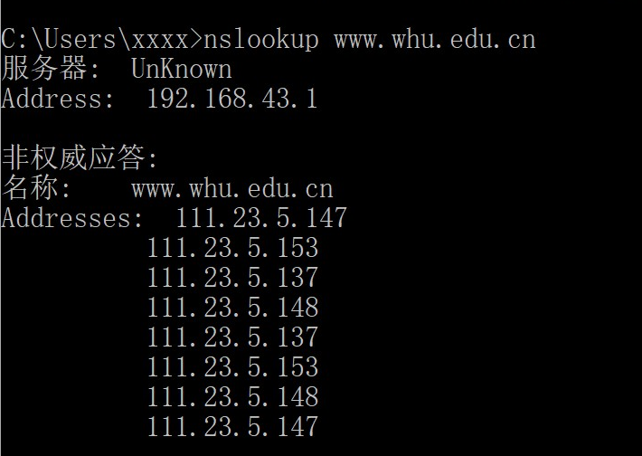

# 网络及分布式第四次作业

2017302580201-贺谷穗子

### 一、nslookup命令

nslookup，名称服务器查找，是许多计算机操作系统中可用的网络管理命令行工具，用于查询域名系统以获得域名或IP地址映射或其他DNS记录。

下面是我使用使用nslookup命令查询结果截图：

### 三、课本第二章习题选做三道

> P8.参照习题P7,假定在同一服务器上某HTML文件引用了 8个非常小的对象。忽略发送时间，在下列 情况下需要多长时间： 
>
> a.没有并行TCP连接的非持续HTTP。
>
> b.配置有5个并行连接的非持续HTTP。
>
>  c.持续 HTTPO

a)$18RTT_O+RTT_1+RTT_2+...+RTT_n$

b)$6RTT_O+RTT_1+RTT_2+...+RTT_n$

c)$3RTT_O+RTT_1+RTT_2+...+RTT_n$

> P3.考虑一个要获取给定URL的Web文档的HTTP客户。该HTTP服务器的IP地址开始时并不知道。在 这种情况下，除了 HTTP外，还需要什么运输层和应用层协议？

应用层还需要DNS协议，对应的运输层需要TCP(HTTP需要)和UDP(DNS需要)协议。

> P13.SMTP中的MAIL FROM与该邮件报文自身中的From：之间有什么不同？

SMTP中MAIL FROM是握手协议的一部分，用来标识邮件发送人。邮件报文中的From:是报文的一部分