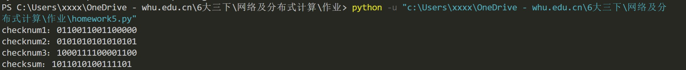

# 网络及分布式第五次作业

2017302580201-贺谷穗子

### 一、用 python 实现 UDP 的16位校验和，并用该程序验证课本3.3.2节的计算

发送方的UDP对报文段中所有16比特的字的和进行反码运算，求和时遇到的任何溢出都被回卷。模拟发送数据时计算数据包校验和的步骤如下：

 1、把校验和字段设置为0；

  2、把需要校验的数据看成以16位为单位的数子组成，依次进行二进制反码求和；

 3、把得到的结果存入校验和字段中

homework5.py的代码如下：

```python
import numpy as np

def udp_checksum(source_string):
    #校验和字段设为0
    sum = 0
    for bit in source_string:
        # 检查位数是否为16
        if len(bit) != 16:
            return
        #依次求和    
        sum += int(bit, 2)
        # 回卷
        sum = (sum & 0xffff)+((sum >> 16) & 0x1)
    # 取反
    sum = sum ^ 0xffff
    return sum

if __name__=='__main__':
    list=["0110011001100000",
          "0101010101010101",
          "1000111100001100"]
    for i in range(len(list)):
        print("checknum{0}：{1}".format(i+1,list[i]))
    print("checksum：{0}".format(np.binary_repr(udp_checksum(list),16)))
```

运行结果如下：

与课本比对验证成功


### 二、课本第三章习题选做两道

> P4. a.假定你有下列2个字节：01011100和011001010这2个字节之和的反码是什么？
>
>  b. 假定你有下列2个字节：11011010和011001010这2个字节之和的反码是什么？
>
>  c. 对于（a）中的字节，给出一个例子，使得这2个字节中的每一个都在一个比特反转时，其反码不会改变。

a)00111110

b)01000000

c)第一个字节取01010100；第二个字节取01101101。


> P16.假设某应用使用rdt3.0作为其运输层协议。因为停等协议具有非常低的信道利用率（显示在网络跨 越国家的例子中），该应用程序的设计者让接收方持续回送许多（大于2）交替的ACK0和ACK 1, 即使对应的数据未到达接收方。这个应用程序设计将能增加信道利用率吗？为什么？该方法存在某 种潜在的问题吗？试解释之。

能增加利用率。这实际上会导致发送方向通道发送大量流水线数据，接收到 ACK0 或 ACK1 之后发送方认为分组已经成功到达，但是事实不是如此。

存在潜在问题。如果数据段丢失在通道中，发送方将不会重新发送这些段，或者有时候会出现无意义的重发。