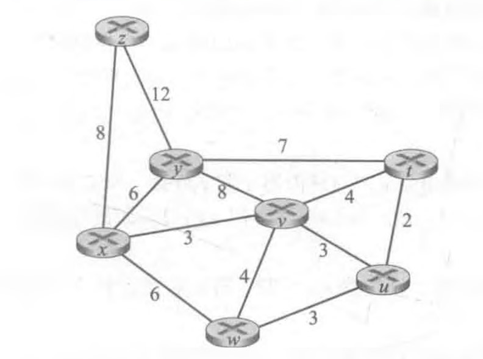

# 网络及分布式第九次作业

2017302580201-贺谷穗子

### 一、课本第四章习题选做三道

> P2.观察图5-3,列举从x到z、z到u以及z到w的不包含任何环路的路径。

x到z不包含环路的路径：

x-y-z, x-y-w-z, x-w-z, x-w-y-z,x-v-w-z, x-v-w-y-z,x-u-w-z, x-u-w-y-z, x-u-v-w-z, x-u-v-w-y-z

z到u不包含环路的路径：

z-w-u, z-w-v-u, z-w-x-u, z-w-v-x-u, z-w-x-v-u, z-w-y-x-u, z-w-y-x-v-u, z-y-x-u, z-y-x-v-u, z-y-x-w-u, z-y-x-w-y-u, z-y-x-v-w-u,z-y-w-v-u, z-y-w-x-u, z-y-w-v-x-u, z-y-w-x-v-u, z-y-w-y-x-u, z-y-w-y-x-v-u

z到w不包含环路的路径：

z-w, z-y-w, z-y-x-w, z-y-x-v-w, z-y-x-u-w, z-y-x-u-v-w, z-y-x-v-u-w

> p3.考虑下面的网络。对于标明的链路开销，用Dijkstra的最短路算法计算出从兀到所有网络节点的最短路径。通过计算一个类似5-1的表，说明该算法是如何工作的。
>
> 

| 步骤 | *N’*    | *D(t),p(t)* | *D(u),p(u)* | *D(v),p(v)* | *D(w),p(w)* | *D(y),p(y)* | *D(z),p(z)* |
| ---- | ------- | ----------- | ----------- | ----------- | ----------- | ----------- | ----------- |
| 0    | x       | ∞           | ∞           | 3,x         | 6,x         | 6,x         | 8,x         |
| 1    | xv      | 7,v         | 6,v         | 3,x         | 6,x         | 6,x         | 8,x         |
| 2    | xvu     | 7,v         | 6,v         | 3,x         | 6,x         | 6,x         | 8,x         |
| 3    | xvuw    | 7,v         | 6,v         | 3,x         | 6,x         | 6,x         | 8,x         |
| 4    | xvuwy   | 7,v         | 6,v         | 3,x         | 6,x         | 6,x         | 8,x         |
| 5    | xvuwyt  | 7,v         | 6,v         | 3,x         | 6,x         | 6,x         | 8,x         |
| 6    | xvuwytz | 7,v         | 6,v         | 3,x         | 6,x         | 6,x         | 8,x         |

> P6.考虑一个一般性拓扑（即不是以上所显示的特定网络）和一个同步版本的距离向量算法。假设每次迭代时，一个节点与其邻居交换其距离向量并接收它们的距离向量。假定算法开始时，每个节点只知道到其直接邻居的开销，在该分布式算法收敛前所需的最大迭代次数是多少？评估你的答案。
>

最大迭代次数为图中两节点之间的最长无环路径的长度。
